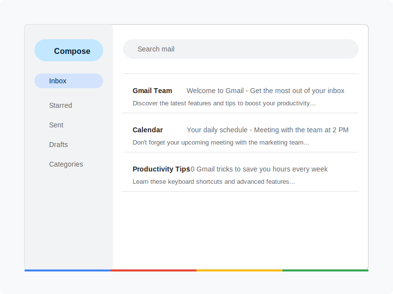

# Dot Trik Gmail

A modern web application that generates all possible Gmail dot trick variations from a single Gmail address.



## Features

- **Gmail Dot Trick Generator**: Create all possible email variations by inserting dots in the username
- **Copy All Functionality**: Easily copy all generated email variations with a single click
- **Educational Content**: Learn about the Gmail dot trick and its practical applications
- **Dynamic Navbar**: Navigation bar that changes style on scroll for better user experience
- **Smooth Scrolling**: Enhanced navigation with smooth scrolling between sections
- **Scroll-to-Top Button**: Animated button that appears when scrolling down for easy navigation
- **Modern Glass Morphism UI**: Beautiful, modern interface with glass effect components
- **Responsive Layout**: Fully responsive design that works on all devices
- **Google-Inspired Color Scheme**: Colors that match the Gmail brand identity
- **SVG Illustrations**: Custom illustrations that explain the dot trick concept
- **Interactive Elements**: Cursor feedback and animations for better user experience

## What is the Gmail Dot Trick?

The Gmail dot trick is based on a simple fact: **Gmail ignores all dots (periods) in the username part of Gmail addresses**.

This means that if your email is `johndoe@gmail.com`, all of these variations will deliver to your inbox:
- `john.doe@gmail.com`
- `j.ohndoe@gmail.com`
- `j.o.h.n.d.o.e@gmail.com`

Our generator creates all possible dot variations of your Gmail address, which you can use for:
- Creating multiple accounts on websites that require unique emails
- Organizing emails by using different variations for different services
- Tracking which services share your email with others

## Technologies Used

- [Next.js 14](https://nextjs.org) - React framework with App Router
- [TypeScript](https://www.typescriptlang.org/) - Type-safe JavaScript
- [Tailwind CSS](https://tailwindcss.com/) - Utility-first CSS framework
- [Geist Font](https://vercel.com/font) - Modern, minimal typeface

## Getting Started

First, clone the repository:

```bash
git clone https://github.com/yourusername/dot-trik-gmail.git
cd dot-trik-gmail
```

Install the dependencies:

```bash
npm install
# or
yarn install
# or
pnpm install
```

Run the development server:

```bash
npm run dev
# or
yarn dev
# or
pnpm dev
```

Open [http://localhost:3000](http://localhost:3000) with your browser to see the result.

## Project Structure

```
dot-trik-gmail/
├── public/                  # Static assets
│   ├── icons/               # SVG icons for features
│   └── *.svg                # Various illustrations
├── src/
│   ├── app/                 # Next.js App Router
│   │   ├── components/      # React components
│   │   │   ├── DotTrickGenerator.tsx  # Generator component
│   │   │   ├── Navbar.tsx            # Dynamic navbar
│   │   │   └── ScrollToTop.tsx       # Scroll to top button
│   │   ├── utils/           # Utility functions
│   │   │   └── scrollUtils.ts        # Smooth scrolling utilities
│   │   ├── globals.css      # Global styles
│   │   └── page.tsx         # Main page component
│   └── ...
└── ...
```

## Deployment

The application can be easily deployed to platforms like Vercel, Netlify, or GitHub Pages.

```bash
# Build for production
npm run build

# Start production server
npm start
```

## Contributing

Contributions are welcome! Please feel free to submit a Pull Request.

## License

This project is licensed under the MIT License - see the LICENSE file for details.

## Acknowledgements

- Google for creating Gmail and its interesting dot trick feature
- Next.js team for the amazing framework
- All contributors who have helped improve this project
